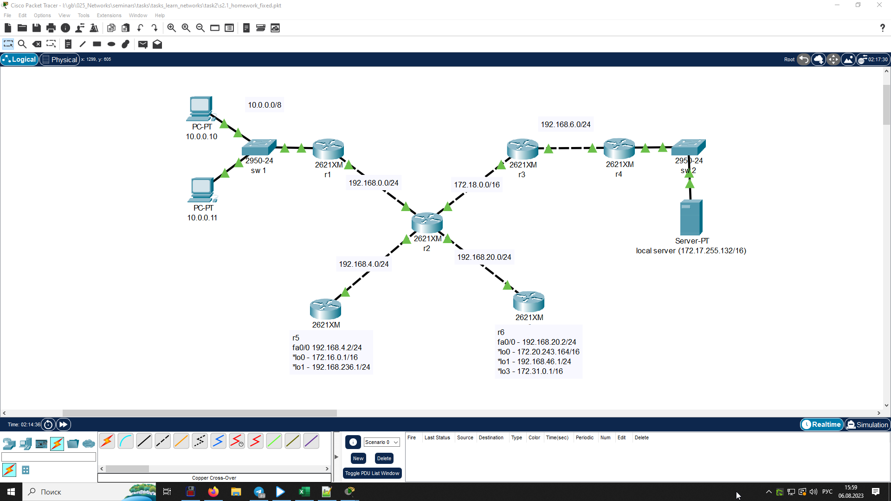
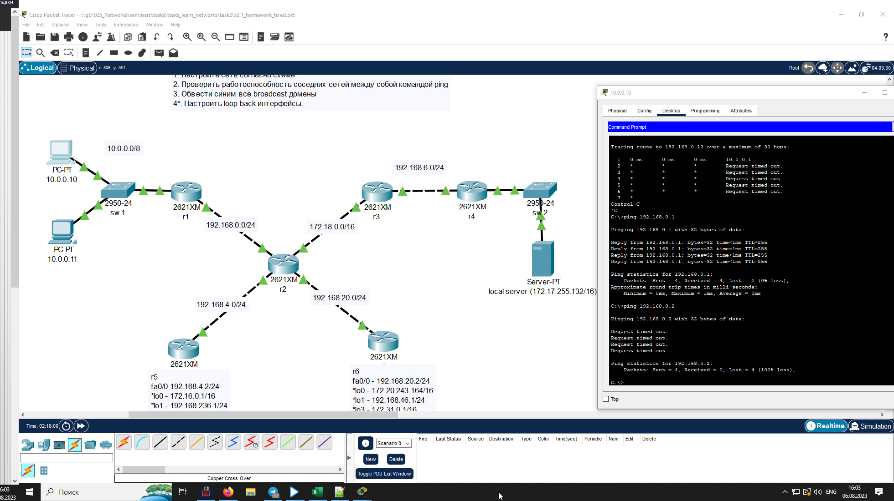
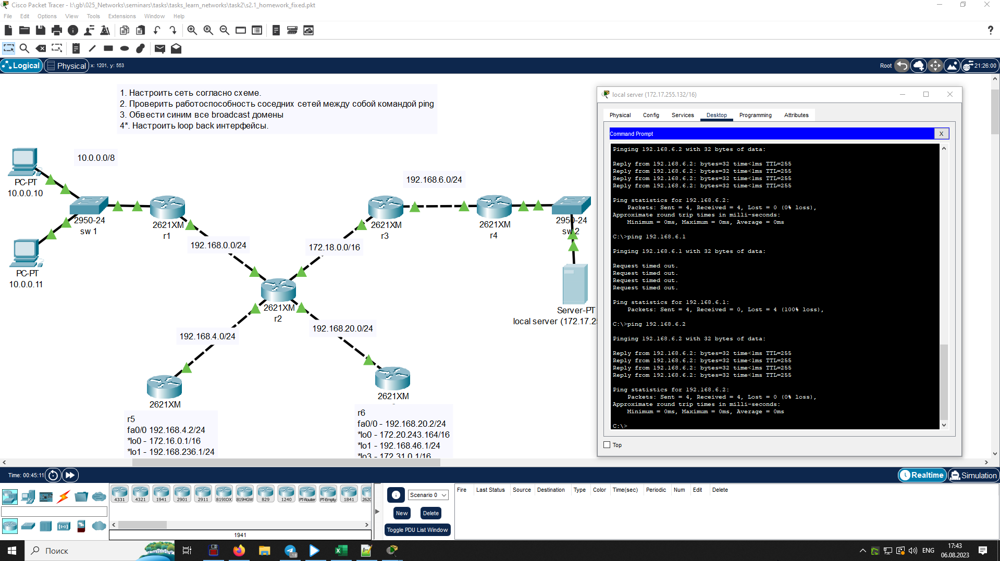
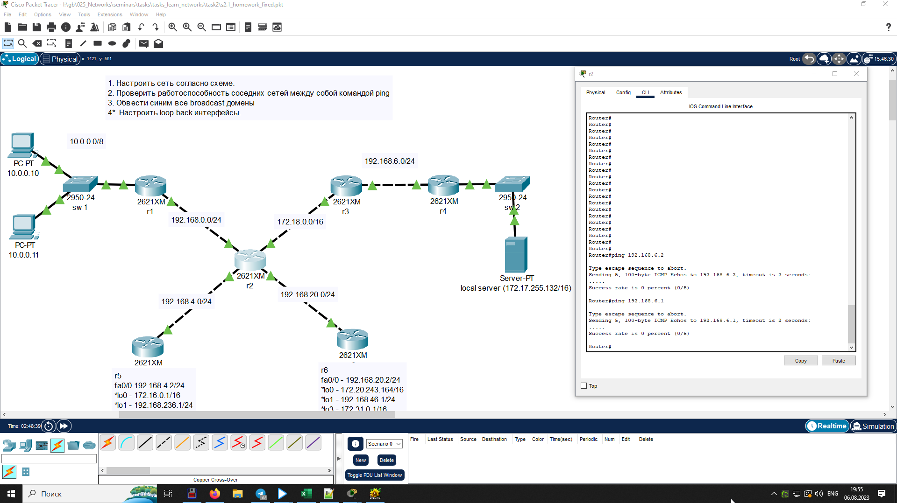
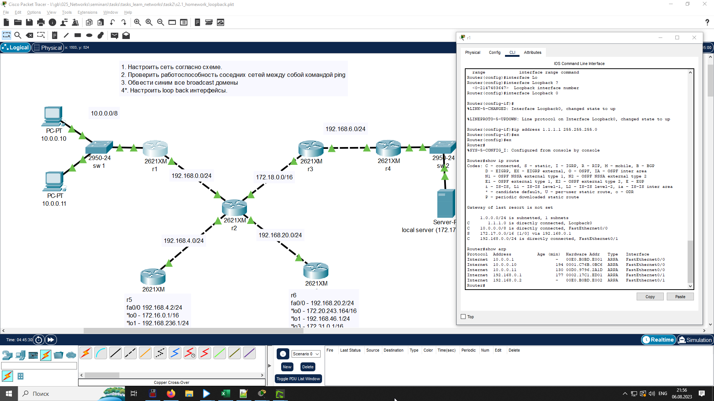
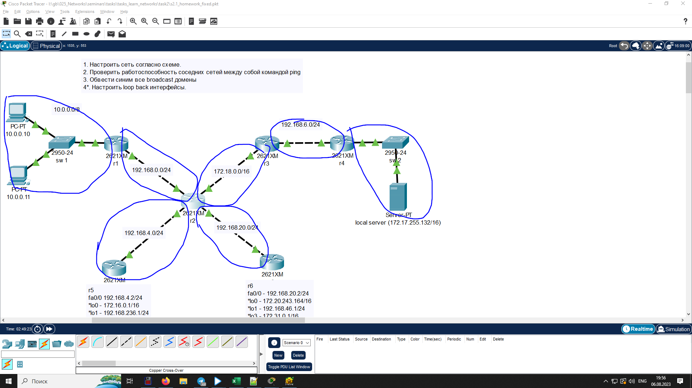
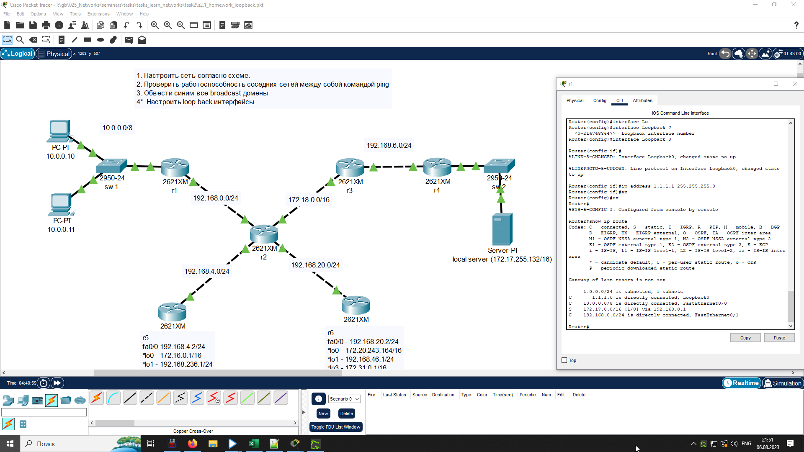

## Урок 2. Технология Ethernet. Протокол IP.
---
1. Настроить сеть согласно схеме в файле **s2.1_homework.pkt**

2. Проверить работоспособность соседних между собой сетей командой ping.

* ping 192.168.0.2 - Request timed out, т.к. не настороена статическая маршрутизация 

3. вывод любой таблицы ARP

4. Обвести синим все broadcast домены

5. Настроить loopback интерфейсы

