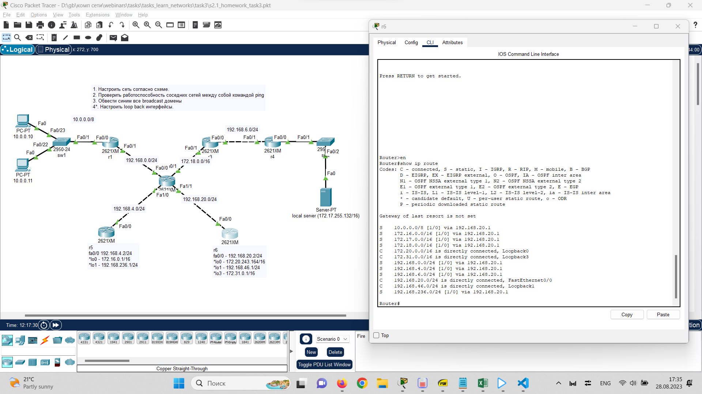

Урок 3. Технология Ethernet. Протокол IP.
---
Условие:
1. Усложняем сеть из предыдущего домашнего задания
Используя только статическую маршрутизацию связать сеть компов и сервера
2. Проверить работоспособность сети командой ping с компов до сервера и обратно

    2.1. * Попробовать настроить статику так, чтобы пинговались все интерфейсы отовсюду.

3. Изучить получившиеся таблицы маршрутизации

4. Попрактиковаться в использовании команды tracert

6.* Настроить loop back интерфейсы, статику до них и они тоже должны пинговаться

* lo0 - 172.16.0.1/16
* lo1 - 192.168.236.1/24

* lo0 - 172.20.243.164/16
* lo1 - 192.168.46.1/24
* lo3 - 172.31.0.1/16

* ping loop back интерфейсов

* получившиеся таблицы маршрутизации

