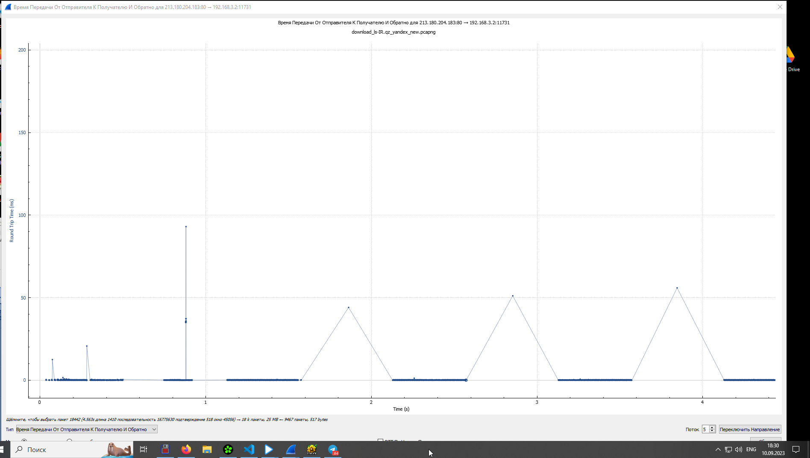

Урок 5. Основы компьютерных сетей. Транспортный уровень. UDP и TCP.
---
Условие:
1. В приложенном файле “The Ultimate PCAP.pcap” (из раздаточного материала) найти e-mail. Что внутри письма и для кого оно?

2. Закрепите навыки фильтрования. Запустите трейс до 8.8.8.8. И перехватите его в Wireshark. Проанализируйте.

* Пакет №16 - первый из трех ICMP пакетов с ttl = 1 хоп, т.е. пакет дойдет до домашнего роутера и будет уничтожен.
* Пакет №17 - ответ от домашнего роутера
* Пакет №43 - первый из трех ICMP пакетов с ttl = 2 хоп, т.е. пакет дойдет черех домашний роутер до роутера провайдераи будет уничтожен.
* Пакет №49 - ответ от роутера провайдера

* Пакет №961 - первый из трех пингов с ttl = 20 хоп, т.е. пакет дойдет до роутера с IP 8.8.8.8 и будет уничтожен. 

3. Закрепите навыки фильтрования. Найдите еще один сайт без шифрования с возможностью ввода логина/пароля. (можно в гугл настроить соответствующую выдачу по запросу с ключом “-inurl:https” в конце). Перехватите их в Wiresharke, построив фильтр.

4*. На сайте https://launchpad.net/ubuntu/+archivemirrors представлены зеркала с образами Убунту по странам. Скачайте файл ls-lR.gz из Чили и с Яндекса. Снимите два дампа для каждого скачивания. Проанализируйте скорость скачивания и посмотрите tcptrace. Прикиньте средний RTT и поищите максимальный RWND для скачивающего.
Предоставить скриншоты графиков скорости и tcptrace. Есть ли разница? В чем она?

* Скорость скачивания из Чили в среднем около 200 kbps, с яндекса в среднем около 42 Mbps, в пике до 60 Mbps. Разница скоростей из Чили и яндекса в 200 раз. Что обусловлено расстоянием, кол-вом и загруженностью промежуточного оборудования между конечными отправителем и получателем.

* Средний RTT у Чили примерно 20 ms

* Средний RTT у yandex примерно 0.4 ms, что примерно в 50 раз меньше чем у Чили

* tcptrace - из графиков видно, что ширина окна у Чили мизирная, почти сливается, что говорит о малой пропускной способности канала и невозможности нарастить объем передаваемых данных.

* RWND у Чили росло только на старте до значения 131070 на 4 секунде и далее оставалось на одном уровне, что говорит о загруженности канала на стороне отправителя (или промежуточного оборудования) и невозможности увеличить ширину канала

* RWND у yandex максимальный рост окна пришелся на 0,5 секунду до значения 3300000, что примерно в 30 раз больше чем у Чили

