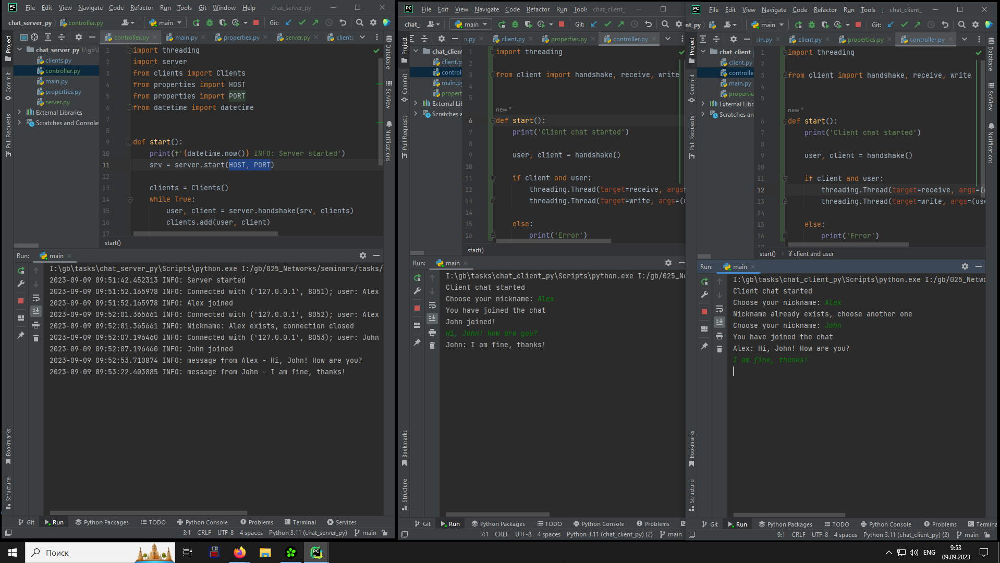
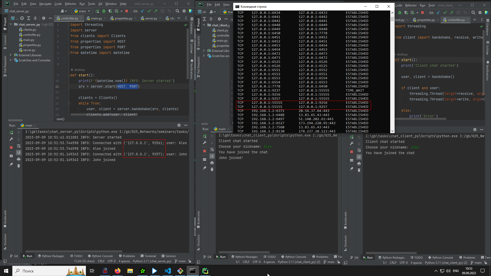
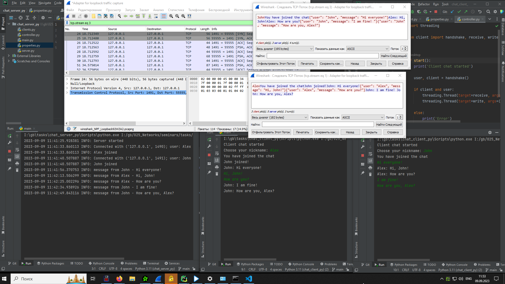

# Урок 6. Основы компьютерных сетей. Транспортный уровень. UDP и TCP.
---
## Условие:
1. Напишите свою программу сервер и запустите её. (если опыта в python нет, запустите готовый код и разберитесь, как он работает - файл с кодом готового клиента: https://disk.yandex.ru/d/cAfsjjG_mLqF3A файл с кодом готового сервера: https://disk.yandex.ru/d/qrj4qpiXhXVwgw) Попробуйте улучшить код, опишите что сделали, какие фичи добавили.
2. Запустите несколько клиентов. Сымитируйте чат.
3. Отправьте мне код написанного сервера (можете через github, если удобно или прямо здесь в txt формате) и скриншоты работающего чата.

### Решение:

* Произведен рефакторинг и внесены изменения серверной части чата - https://github.com/iamseryy/tasks_learn_networks/tree/main/task6/chat_server_py
* Произведен рефакторинг и внесены изменения клиентской части чата - https://github.com/iamseryy/tasks_learn_networks/tree/main/task6/chat_client_py
* Внесенные изменения в функциональность чата:
    * использование кодировки utf-8
    * контроль уникальности ника
    * пользователь получает сообщения только от сервера, которые предназначаются ему или все сообщения от остальных пользователей, свои сообщения пользователь не получает
    * на сервере логируются события подключения/ отключения пользователей, все пользовательские сообщения
    * использование json сериализации для передачи сообщений

4. Отследите сокеты с помощью команды netstat. (тоже пришлите скриншот именно сокетов вашего чата)

5. Перехватите трафик своего чата в Wireshark и cшейте сессию. Пришлите скриншот сшитой сессии с диалогом.

